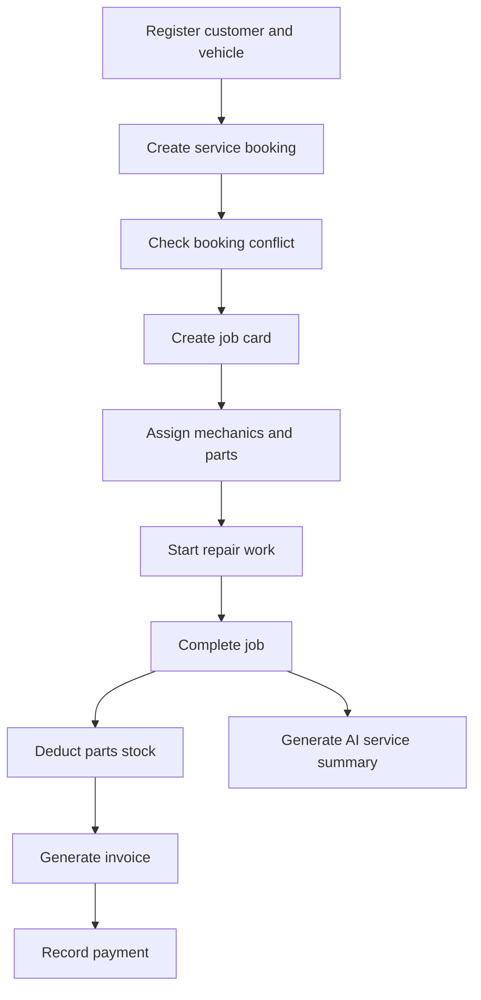
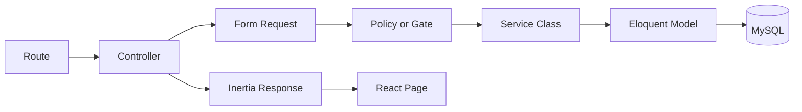
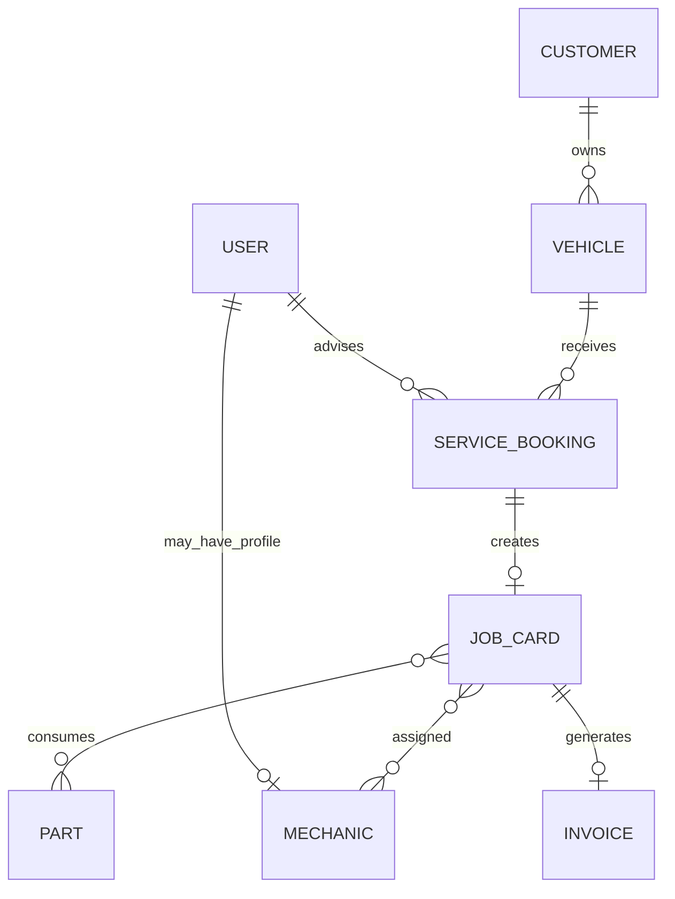

# Vehicle Service Management System

An enterprise-style web application for managing the complete vehicle-service workflow—from customer and vehicle registration to bookings, workshop jobs, parts usage, invoicing, payments, and operational reporting.

> **Simple vehicle servicing from booking to invoice.**  
> Register customers and vehicles, schedule services, track repair work, and manage invoices in one system.

---

## Table of Contents

- [Project Overview](#project-overview)
- [Key Features](#key-features)
- [Technology Stack](#technology-stack)
- [System Roles](#system-roles)
- [Application Workflow](#application-workflow)
- [Architecture](#architecture)
- [Database Design](#database-design)
- [Project Structure](#project-structure)
- [Requirements](#requirements)
- [Installation](#installation)
- [Environment Configuration](#environment-configuration)
- [Running the Application](#running-the-application)
- [Demo Accounts](#demo-accounts)
- [Module Documentation](#module-documentation)
- [AI Service Summary](#ai-service-summary)
- [Business Rules and Data Integrity](#business-rules-and-data-integrity)
- [Testing](#testing)
- [Manual End-to-End Test](#manual-end-to-end-test)
- [Troubleshooting](#troubleshooting)
- [Screenshots](#screenshots)
- [Demo Video](#demo-video)
- [Security](#security)
- [Known Limitations](#known-limitations)
- [Future Improvements](#future-improvements)
- [Submission Checklist](#submission-checklist)
- [Author](#author)

---

## Project Overview

The Vehicle Service Management System is a Laravel and Inertia.js application developed for a vehicle service center. It replaces disconnected manual records with a centralized workflow for:

- Customer and vehicle registration
- Service appointment scheduling
- Mechanic and spare-parts assignment
- Job-card progress tracking
- Automatic stock deduction
- Invoice generation and payment tracking
- Role-based dashboards
- AI-assisted job-completion summaries

The application follows Laravel best practices by separating validation, authorization, business logic, persistence, and user-interface responsibilities.

### Business Scenario

Customers bring vehicles to the service center for routine maintenance or repairs. Service Advisors manage customer records and appointments, Mechanics perform assigned work and update job progress, and Admin users supervise staff, inventory, billing, and overall operations.

The system prevents scheduling conflicts, protects inventory quantities, calculates invoice totals, and provides live operational data through role-specific dashboards.

---

## Key Features

### Authentication and Authorization

- Login, registration, logout, password reset, and email verification
- Role-based access control using Spatie Laravel Permission
- Laravel Policies and Gates for server-side authorization
- Role-specific dashboards and sidebar navigation
- Admin interface for assigning and editing user roles

### Customer and Vehicle Management

- Full customer CRUD operations
- Full vehicle CRUD operations
- Customer-to-vehicle ownership relationship
- Search, filtering, sorting, pagination, and modal forms
- Public customer and vehicle registration without authentication

### Service Operations

- Service appointment creation and management
- Overlapping-booking prevention for the same vehicle
- Unique booking and job-card numbers
- Mechanic assignment
- Spare-parts assignment with quantities and captured prices
- Job statuses: Pending, In Progress, Completed, and Cancelled
- Assigned-job filtering for Mechanic users

### Inventory and Billing

- Parts inventory CRUD
- Stock quantity, minimum-stock level, and unit-price tracking
- Low-stock alerts
- Controlled stock adjustments
- Automatic stock deduction when a job is completed
- Unique invoice-number generation
- Labor and parts total calculation
- Pending and Paid payment statuses
- Print-friendly invoice view

### Dashboard and AI

- Today’s bookings
- Active jobs
- Low-stock alerts
- Daily paid revenue
- AI-generated professional service-completion summaries

---

## Technology Stack

| Layer | Technology | Purpose |
|---|---|---|
| Backend | Laravel 13 / PHP 8.3 | Routing, validation, authorization, business logic, and ORM |
| Frontend | Inertia.js + React | Reactive user interface without maintaining a separate REST frontend |
| Styling | Tailwind CSS | Responsive and reusable interface styling |
| Database | MySQL | Relational storage, constraints, and transactions |
| Authentication | Laravel Breeze | Authentication and profile workflows |
| Authorization | Spatie Laravel Permission | Roles and permissions |
| Build Tool | Vite / npm | Frontend development and production builds |
| AI Integration | OpenAI Responses API | Professional job-completion summaries |
| Version Control | Git | Source history and collaboration |

---

## System Roles

| Role | Main Access |
|---|---|
| **Admin** | Full system access, users and roles, customers, vehicles, mechanics, bookings, jobs, parts, invoices, and dashboard |
| **Service Advisor** | Customers, vehicles, bookings, job coordination, invoices, and operational dashboard |
| **Mechanic** | Assigned jobs and permitted job-status/work updates |
| **Public Visitor** | Landing page and guest customer/vehicle registration form |

> Hiding a sidebar link is only a usability feature. Policies, Gates, permissions, and middleware provide the actual security enforcement.

---

## Application Workflow



### Typical Operational Flow

1. A customer and vehicle are registered by staff or through the public form.
2. A Service Advisor creates a service booking.
3. The system checks the requested time against existing bookings for the same vehicle.
4. A job card is created from the booking.
5. Active mechanics and available parts are assigned.
6. The assigned Mechanic updates the job to **In Progress**.
7. Diagnosis and completed work are recorded.
8. When the job becomes **Completed**, stock is deducted once inside a transaction.
9. An invoice is generated from labor and parts costs.
10. The invoice can be marked **Paid**.
11. An authorized user can generate an AI Service Summary for the completed job.

---

## Architecture

The application uses thin controllers and separates business responsibilities into dedicated Laravel layers.



| Component | Responsibility |
|---|---|
| Routes | Map HTTP requests to controller actions |
| Controllers | Coordinate requests, services, and responses |
| Form Requests | Validate and authorize incoming form data |
| Policies/Gates | Enforce resource-level permissions |
| Service Classes | Apply business rules and database transactions |
| Models | Define fields, casts, scopes, and relationships |
| Inertia Pages | Render server-provided data using React |
| Tailwind Components | Provide responsive and consistent presentation |

---

## Database Design

### Main Tables

| Table | Purpose |
|---|---|
| `users` | Authenticated staff accounts |
| `roles`, `permissions`, and Spatie pivots | Role-based access control |
| `customers` | Customer contact and service information |
| `vehicles` | Vehicles belonging to customers |
| `mechanics` | Workshop mechanic profiles |
| `parts` | Spare-parts inventory |
| `service_bookings` | Service appointments |
| `job_cards` | Diagnosis, repair work, labor, statuses, and AI summaries |
| `job_card_mechanic` | Many-to-many mechanic assignments |
| `job_card_part` | Assigned parts, quantities, and historical unit prices |
| `invoices` | Labor totals, parts totals, grand totals, and payment status |

### Entity Relationships



### Important Integrity Rules

- Customer email, vehicle registration number, VIN, employee ID, and generated business numbers use appropriate validation or uniqueness constraints.
- Parent tables must be migrated before foreign-key and pivot tables.
- A booking has one job card; it is not a many-to-many relationship.
- Part unit prices are stored in `job_card_part` so historical invoices remain unchanged when master prices change.
- Critical multi-record operations use database transactions.

---

## Project Structure

```text
app/
├── Enums/
│   ├── BookingStatus.php
│   ├── JobStatus.php
│   └── PaymentStatus.php
├── Http/
│   ├── Controllers/
│   │   ├── Admin/
│   │   ├── CustomerController.php
│   │   ├── DashboardController.php
│   │   ├── InvoiceController.php
│   │   ├── JobCardController.php
│   │   ├── MechanicController.php
│   │   ├── PartController.php
│   │   ├── PublicVehicleRegistrationController.php
│   │   ├── ServiceBookingController.php
│   │   └── VehicleController.php
│   └── Requests/
├── Models/
├── Policies/
└── Services/
    ├── AIServiceSummaryService.php
    ├── BookingService.php
    ├── InvoiceService.php
    └── JobCardService.php

database/
├── factories/
├── migrations/
└── seeders/

resources/js/
├── Components/
├── Layouts/
│   ├── AppLayout.jsx
│   └── GuestLayout.jsx
└── Pages/
    ├── Admin/
    ├── Auth/
    ├── Bookings/
    ├── Customers/
    ├── Dashboard/
    ├── Invoices/
    ├── JobCards/
    ├── Mechanics/
    ├── Parts/
    ├── Vehicles/
    └── Welcome.jsx

routes/
├── auth.php
└── web.php
```

---

## Requirements

Install the following before running the application:

- PHP 8.3 or later
- Composer
- Node.js and npm
- MySQL
- Git

Required PHP extensions include:

- `pdo_mysql`
- `fileinfo`
- `openssl`
- `curl`
- `mbstring`
- `zip`

Confirm the active PHP configuration:

```powershell
php --version
php --ini
php -m
composer --version
node --version
npm --version
```

---

## Installation

### 1. Clone the Repository

```powershell
git clone <YOUR_GITHUB_REPOSITORY_URL>
cd Vehicle-Service-Management-System
```

### 2. Install Backend Dependencies

```powershell
composer install
```

### 3. Install Frontend Dependencies

```powershell
npm install
```

### 4. Create the Environment File

```powershell
Copy-Item .env.example .env
```

On macOS or Linux:

```bash
cp .env.example .env
```

### 5. Generate the Application Key

```powershell
php artisan key:generate
```

### 6. Create the Database

Create a MySQL database named:

```text
vehicle_service_management
```

Example MySQL command:

```sql
CREATE DATABASE vehicle_service_management
CHARACTER SET utf8mb4
COLLATE utf8mb4_unicode_ci;
```

### 7. Configure `.env`

Update the database and application values using the example in the next section.

### 8. Run Migrations and Seeders

```powershell
php artisan migrate --seed
```

For a disposable development database that may safely be rebuilt:

```powershell
php artisan migrate:fresh --seed
```

> `migrate:fresh` deletes all application tables and data. Do not run it against a database containing important records.

### 9. Create the Storage Link

```powershell
php artisan storage:link
```

### 10. Clear Cached Configuration

```powershell
php artisan optimize:clear
```

---

## Environment Configuration

Use the following structure in `.env`:

```dotenv
APP_NAME="Vehicle Service Management System"
APP_ENV=local
APP_KEY=
APP_DEBUG=true
APP_URL=http://127.0.0.1:8000

DB_CONNECTION=mysql
DB_HOST=127.0.0.1
DB_PORT=3306
DB_DATABASE=vehicle_service_management
DB_USERNAME=root
DB_PASSWORD=

OPENAI_API_KEY=your_secret_key_here
OPENAI_MODEL=gpt-5-mini
```

The OpenAI configuration should be mapped in `config/services.php`:

```php
'openai' => [
    'key' => env('OPENAI_API_KEY'),
    'model' => env('OPENAI_MODEL', 'gpt-5-mini'),
],
```

### Secret Management

- Never commit `.env`.
- Never place the OpenAI API key in React code.
- Never pass the key as an Inertia prop.
- Never include the real key in screenshots or the demo video.
- Keep `.env.example` limited to empty or clearly fake placeholders.

---

## Running the Application

Open two PowerShell terminals in the project directory.

### Terminal 1: Laravel

```powershell
php artisan serve
```

### Terminal 2: Vite

```powershell
npm run dev
```

Open:

```text
http://127.0.0.1:8000
```

### Production Build

```powershell
npm run build
```

---

## Demo Accounts

After running the project seeders, use the following local demonstration accounts if they match your `DatabaseSeeder` configuration:

| Role | Email | Password |
|---|---|---|
| Admin | `admin@example.com` | `password` |
| Service Advisor | `advisor@example.com` | `password` |
| Mechanic | `mechanic@example.com` | `password` |

> These credentials are intended only for local demonstration data. Change them before any public or production deployment.

If a newly registered user receives:

```text
403 — Your account does not have a system role.
```

Log in as Admin and assign the user one of the supported roles:

- Admin
- Service Advisor
- Mechanic

---

## Module Documentation

### 1. Public Landing Page

- Available at `/`
- Provides Login and Register actions
- Displays the public customer/vehicle registration form
- Allows visitors to submit vehicle details without authentication
- Uses Form Request validation, a transaction, a honeypot field, and request throttling

The public submission endpoint is limited to five attempts per minute:

```php
Route::post(
    '/vehicle-registration',
    [PublicVehicleRegistrationController::class, 'store']
)
    ->middleware('throttle:5,1')
    ->name('public.vehicle.store');
```

### 2. Customer Management

- Create, list, search, update, and delete customers
- Stores name, email, phone, address, and notes
- Loads related vehicles when required
- Uses Form Requests and authorization policies

### 3. Vehicle Management

- Each vehicle belongs to one customer
- Stores registration number, make, model, year, VIN, and mileage
- Uses registration-number and VIN validation
- Supports responsive tables, search, pagination, and modal forms

### 4. Mechanic Management

- Stores name, employee ID, specialization, contact information, and active status
- May link a mechanic profile to a User account
- Only active mechanics are available for new job assignments
- Mechanic users see only their assigned job cards

### 5. Service Bookings

- Creates appointments with start and end date/time values
- Stores the customer complaint and booking status
- Generates a unique booking number
- Prevents overlapping bookings for the same vehicle

Overlap rule:

```text
existing.starts_at < requested.ends_at
AND existing.ends_at > requested.starts_at
AND existing.status != cancelled
```

### 6. Job Cards

- Created from bookings that do not already have a job card
- Stores diagnosis, work description, labor cost, and status
- Assigns one or more mechanics
- Assigns parts with quantities and captured unit prices
- Tracks `started_at`, `completed_at`, and `stock_deducted_at`
- Stores the AI completion summary and generation timestamp

Job statuses:

| Status | Meaning |
|---|---|
| Pending | Job exists but work has not started |
| In Progress | A Mechanic has started work |
| Completed | Approved work has been completed |
| Cancelled | Job was stopped without stock deduction |

### 7. Parts Inventory

- Create, search, update, and delete parts
- Track stock quantity, minimum stock, and unit price
- Adjust stock through a dedicated action
- Display low-stock alerts
- Deduct assigned quantities automatically when a job is completed

### 8. Invoices

- Generated from completed job cards
- Uses a unique invoice number
- Calculates labor, parts, and grand totals
- Tracks Pending and Paid payment states
- Records payment date where applicable
- Provides a print-friendly invoice layout

```text
parts_total = SUM(quantity × captured unit_price)
grand_total = labor_total + parts_total
```

### 9. Dashboard

The dashboard reads live database values instead of dummy statistics:

| Metric | Calculation |
|---|---|
| Today’s bookings | Bookings whose start date is today |
| Active jobs | Pending and In Progress job cards |
| Low-stock alerts | `stock_quantity <= minimum_stock` |
| Daily revenue | Paid invoices for the current day |

### 10. Admin Users and Roles

Admin users can:

- View and search users
- Assign Admin, Service Advisor, or Mechanic
- Update a user’s name, email, and role
- Delete permitted user accounts

Safeguards should prevent:

- An Admin deleting their own active account
- An Admin removing their own required access
- Deletion or demotion of the final Admin
- Assignment of arbitrary role names
- Access by non-Admin users

---

## AI Service Summary

### Purpose

The AI Service Summary converts completed job information into a concise, professional, customer-facing service-completion summary.

### Files Involved

| Area | File or Responsibility |
|---|---|
| Model | `app/Models/JobCard.php` |
| Service | `app/Services/AIServiceSummaryService.php` |
| Controller | `app/Http/Controllers/JobCardController.php` |
| Route | AI summary POST route for a job card |
| Frontend | `resources/js/Pages/JobCards/Index.jsx` |
| Configuration | `.env` and `config/services.php` |

### Workflow

1. The job must have a **Completed** status.
2. The user clicks **Generate AI Summary**.
3. The controller authorizes access to the job card.
4. `AIServiceSummaryService` loads the required customer, vehicle, mechanics, and parts information.
5. The service creates a focused prompt.
6. Laravel sends a server-side request to the OpenAI Responses API.
7. The service validates and returns the generated text.
8. The controller stores:
   - `ai_summary`
   - `ai_summary_generated_at`
9. The React page displays the saved summary and provides a regeneration action.

### Verify AI Storage with Tinker

Run:

```powershell
php artisan tinker
```

Paste this as one complete expression:

```php
$job = App\Models\JobCard::whereNotNull('ai_summary')->latest('ai_summary_generated_at')->first();
```

Then:

```php
$job?->only(['job_number', 'ai_summary', 'ai_summary_generated_at']);
```

Do not begin a new Tinker command with `->` after the previous line has already executed.

### Windows SSL Certificate Configuration

If the API request fails with:

```text
cURL error 60: SSL certificate problem: unable to get local issuer certificate
```

Use the secure fix:

1. Download an official CA certificate bundle.
2. Store it in a stable local path, for example:

   ```text
   D:\KALINDU\cacert.pem
   ```

3. Identify the active `php.ini`:

   ```powershell
   php --ini
   ```

4. Set these values in the active `php.ini`:

   ```ini
   curl.cainfo = "D:\KALINDU\cacert.pem"
   openssl.cafile = "D:\KALINDU\cacert.pem"
   ```

5. Restart Laravel, Vite, and Tinker.
6. Retest the connection.

Do not use `Http::withoutVerifying()` as a permanent fix because it disables TLS certificate verification.

---

## Business Rules and Data Integrity

### Double-Booking Protection

A non-cancelled booking for the same vehicle may not overlap another booking’s time range.

### Stock Protection

When completing a job:

1. Start a database transaction.
2. Lock or safely load the required part records.
3. Validate available quantities.
4. Deduct each assigned quantity.
5. Set `stock_deducted_at`.
6. Set `completed_at`.
7. Commit all changes together.

If any step fails, the transaction rolls back.

`stock_deducted_at` makes job completion idempotent and prevents repeated requests from deducting the same stock more than once.

### Invoice Integrity

- An invoice is generated only for an eligible job card.
- Labor and part totals are calculated on the server.
- Part prices come from the job-card pivot, not the current inventory price.
- Financial creation and updates use transactions.

### Authorization

- Internal routes use `auth` and `verified` middleware where required.
- Controllers and services do not trust the frontend role alone.
- Policies and permissions authorize each sensitive action.
- Mechanic queries are restricted to assigned jobs.

---

## Testing

### Automated Tests

Run:

```powershell
php artisan optimize:clear
php artisan test
```

Run a specific test class:

```powershell
php artisan test --filter=AuthenticationTest
```

### Frontend Production Build

```powershell
npm run build
```

### Route and Migration Verification

```powershell
php artisan migrate:status
php artisan route:list
php artisan route:list --name=job-cards
php artisan route:list --name=parts
```

### Recommended Business Feature Tests

- Admin and Service Advisor authorization
- Mechanic assigned-job filtering
- Same-vehicle overlap rejection
- Different-vehicle booking at the same time
- One-time parts-stock deduction
- Insufficient-stock rollback
- Correct labor and parts invoice totals
- Public registration validation and throttling
- Last-Admin protection
- AI summary authorization and response handling using `Http::fake()`

---

## Manual End-to-End Test

Use this scenario to demonstrate every major module.

### Sample Customer and Vehicle

| Field | Value |
|---|---|
| Customer | Nimal Fernando |
| Email | `nimal.fernando@example.com` |
| Phone | `0771234567` |
| Address | Colombo |
| Vehicle | Toyota Corolla 2019 |
| Registration | `WP CAB-2345` |
| VIN | `JTDBR32E192123456` |
| Mileage | `64200` |

### Sample Mechanics

| Employee ID | Name | Specialization |
|---|---|---|
| `MEC-001` | Dilan Fernando | Engine / General |
| `MEC-002` | Sachini Perera | Electrical |

### Sample Parts

| Part Number | Name | Stock | Minimum | Unit Price |
|---|---|---:|---:|---:|
| `PRT-001` | Engine Oil 5W-30 | 12 | 5 | LKR 5,500 |
| `PRT-002` | Toyota Oil Filter | 8 | 3 | LKR 3,250 |
| `PRT-003` | Front Brake Pad Set | 2 | 3 | LKR 18,500 |
| `PRT-004` | Spark Plug | 20 | 5 | LKR 1,800 |

### Test Steps

1. Log in as Admin.
2. Confirm the dashboard displays live database values.
3. Create Nimal Fernando.
4. Create the Toyota Corolla and connect it to Nimal.
5. Create the sample mechanics.
6. Create the sample parts and confirm the brake-pad set is shown as low stock.
7. Create a booking for `WP CAB-2345`.
8. Attempt an overlapping booking for the same vehicle and confirm it is rejected.
9. Create a job card from the valid booking.
10. Assign Dilan Fernando.
11. Assign one Engine Oil and one Toyota Oil Filter.
12. Set labor cost to LKR 8,000.
13. Log in as the Mechanic and confirm only the assigned job appears.
14. Change the job to **In Progress**.
15. Enter diagnosis and work-completed details.
16. Mark the job **Completed**.
17. Confirm Engine Oil stock changes from 12 to 11.
18. Confirm Oil Filter stock changes from 8 to 7.
19. Generate the invoice.
20. Confirm the total:

    ```text
    LKR 8,000 + LKR 5,500 + LKR 3,250 = LKR 16,750
    ```

21. Mark the invoice Paid.
22. Confirm the dashboard revenue includes LKR 16,750.
23. Generate and display the AI Service Summary.
24. Open Admin Users and Roles and demonstrate role assignment.

---

## Troubleshooting

### `ReflectionException: Controller does not exist`

A route references a controller that has not been created or imported.

Check:

```powershell
Test-Path app\Http\Controllers\MechanicController.php
php artisan route:list
```

Create the missing controller or remove the invalid route.

### Pivot Migration Cannot Open Referenced Table

Example:

```text
Failed to open the referenced table 'mechanics'
```

Create and migrate the parent `mechanics` table before `job_card_mechanic`.

Migration order should follow:

```text
customers
→ vehicles
→ mechanics
→ parts
→ service_bookings
→ job_cards
→ job_card_mechanic
→ job_card_part
→ invoices
```

### Eloquent Relationship Return-Type Error

Import relationship classes from Laravel:

```php
use Illuminate\Database\Eloquent\Relations\BelongsTo;
use Illuminate\Database\Eloquent\Relations\HasOne;
```

Correct booking relationships:

```php
public function vehicle(): BelongsTo
{
    return $this->belongsTo(Vehicle::class);
}

public function jobCard(): HasOne
{
    return $this->hasOne(JobCard::class);
}
```

### Inertia Page Not Found

Example:

```text
Page not found: ./Pages/Vehicles/Index.jsx
```

Confirm that the file exists at the exact expected path and capitalization:

```text
resources/js/Pages/Vehicles/Index.jsx
```

### Ziggy Named Route Error

Example:

```text
route 'mechanics.index' is not in the route list
```

Confirm the named Laravel route exists:

```powershell
php artisan route:list --name=mechanics
```

For optional navigation items, filter them before rendering:

```jsx
navigation.filter((item) => route().has(item.route))
```

### Missing `StatusBadge` During Vite Build

Confirm the component exists:

```text
resources/js/Components/StatusBadge.jsx
```

Use an absolute Vite alias and verify import capitalization.

### Blank React Page

Open the browser console and check for:

- Missing Ziggy routes
- Missing components
- Incorrect Inertia page path
- Invalid imports
- JavaScript runtime errors

Then run:

```powershell
npm run build
```

### Home Feature Test Fails

The public home page now returns a `200` Inertia response instead of redirecting guests to Login. Update the test to assert the Welcome page.

Only one `GET /` route should exist.

### Premature End of PHP Process During Tests

Search the request path for debugging statements:

```text
dd()
dump()
die()
exit()
```

Remove them and rerun:

```powershell
php artisan optimize:clear
php artisan test
```

### AI Connection Error

Check:

- Internet connection
- API key
- `.env` variable names
- `config/services.php`
- active PHP `curl` and `openssl` extensions
- CA certificate configuration
- API account limits and model availability

After changing `.env`, run:

```powershell
php artisan optimize:clear
```

---

## Screenshots

Create the following directory and add clear screenshots before submission:

```text
docs/screenshots/
```

Recommended filenames:

| Screenshot | Suggested File |
|---|---|
| Public landing page | `docs/screenshots/01-landing-page.png` |
| Public vehicle registration | `docs/screenshots/02-public-registration.png` |
| Admin dashboard | `docs/screenshots/03-admin-dashboard.png` |
| Customer management | `docs/screenshots/04-customers.png` |
| Vehicle management | `docs/screenshots/05-vehicles.png` |
| Mechanic management | `docs/screenshots/06-mechanics.png` |
| Booking conflict validation | `docs/screenshots/07-booking-conflict.png` |
| Job card | `docs/screenshots/08-job-card.png` |
| Mechanic assigned jobs | `docs/screenshots/09-mechanic-jobs.png` |
| Parts inventory and low stock | `docs/screenshots/10-parts.png` |
| Invoice | `docs/screenshots/11-invoice.png` |
| Users and roles | `docs/screenshots/12-users-roles.png` |
| AI Service Summary | `docs/screenshots/13-ai-summary.png` |
| Successful tests | `docs/screenshots/14-tests.png` |
| Successful production build | `docs/screenshots/15-build.png` |

Example Markdown after adding the images:

```markdown

```

Do not capture `.env`, API keys, personal credentials, or unrelated files.

---

## Demo Video

Record a 5–10 minute demonstration covering:

| Time | Demonstration |
|---|---|
| 0:00–0:45 | Landing page and public vehicle registration |
| 0:45–1:30 | Login and Admin dashboard |
| 1:30–2:30 | Customer and vehicle CRUD |
| 2:30–3:30 | Booking and conflict validation |
| 3:30–5:00 | Job-card creation and assignments |
| 5:00–6:00 | Mechanic job update and completion |
| 6:00–7:00 | Stock deduction and invoice |
| 7:00–8:00 | AI Service Summary |
| 8:00–9:00 | Admin role management |
| 9:00–10:00 | Architecture, tests, and production build |

Add the final video URL here before submission:

```text
Demo video: <YOUR_DEMO_VIDEO_URL>
```

---

## Security

- Laravel CSRF protection is used for state-changing web requests.
- Passwords are hashed by Laravel authentication.
- Internal routes use authentication and email-verification middleware.
- Spatie permissions and Laravel Policies/Gates protect resources.
- Form Requests validate all submitted data.
- Route-model binding and ownership/role checks restrict access.
- Critical workflows use database transactions.
- The public form uses throttling and a honeypot field.
- The API key remains on the Laravel server.
- `.env`, `vendor`, `node_modules`, and local editor files must be excluded from Git.

Before publishing:

```powershell
git status
git ls-files .env
```

The second command should not list `.env`.

---

## Known Limitations

- Automated coverage is strongest for Laravel Breeze authentication and profile flows; business-module tests should be expanded.
- AI summary generation depends on internet connectivity, a valid API key, account limits, and model availability.
- Public registration requires stronger anti-abuse protection for a production deployment.
- Email notifications, audit logging, calendar view, exports, Docker, and advanced reporting are not claimed as completed.
- Production deployment needs environment-specific HTTPS, backups, monitoring, queues, and secure secret management.

---

## Future Improvements

1. Add feature tests for all critical business rules.
2. Add an activity log and audit trail.
3. Add PDF invoice export.
4. Add Excel reports.
5. Add booking and invoice email notifications.
6. Add a calendar booking view.
7. Add Docker and CI configuration.
8. Add production monitoring and scheduled backups.

---

## Git Workflow

Use small, meaningful commits:

```powershell
git status
git add app routes resources database tests README.md
git commit -m "feat: complete customer and vehicle management"
git commit -m "feat: prevent overlapping service bookings"
git commit -m "feat: deduct parts stock when jobs are completed"
git commit -m "feat: add invoice and payment management"
git commit -m "feat: add admin user role management"
git commit -m "feat: generate AI job completion summaries"
git commit -m "test: cover critical workshop business rules"
git commit -m "docs: add setup and evaluation documentation"
```

Push the final branch:

```powershell
git push origin main
```

---

## Submission Checklist

- [ ] GitHub repository URL added
- [ ] Clean and meaningful Git history
- [ ] `.env` is not committed
- [ ] `README.md` setup tested from a fresh clone
- [ ] Migrations and seeders included
- [ ] Public landing page works
- [ ] Login, registration, and logout work
- [ ] Admin, Service Advisor, and Mechanic roles verified
- [ ] Customer, vehicle, mechanic, and parts CRUD verified
- [ ] Booking conflict prevention demonstrated
- [ ] Mechanic assigned-job filtering demonstrated
- [ ] Stock deduction demonstrated
- [ ] Invoice totals and payment status demonstrated
- [ ] Dashboard uses live database values
- [ ] AI Service Summary demonstrated
- [ ] Screenshots added
- [ ] Documentation included
- [ ] 5–10 minute demo video URL added
- [ ] `php artisan test` passes
- [ ] `npm run build` succeeds

Final verification:

```powershell
php artisan optimize:clear
php artisan migrate:status
php artisan route:list
php artisan test
npm run build
```

---

## Author

**Kalindu Methmuditha**

Vehicle Service Management System  
Laravel 13 Full-Stack Assignment  
Project duration: 7 days

---

## Academic Use

This project was developed for educational and evaluation purposes. Review authentication, environment configuration, anti-abuse controls, backups, logging, and deployment security before using it in a production service center.
